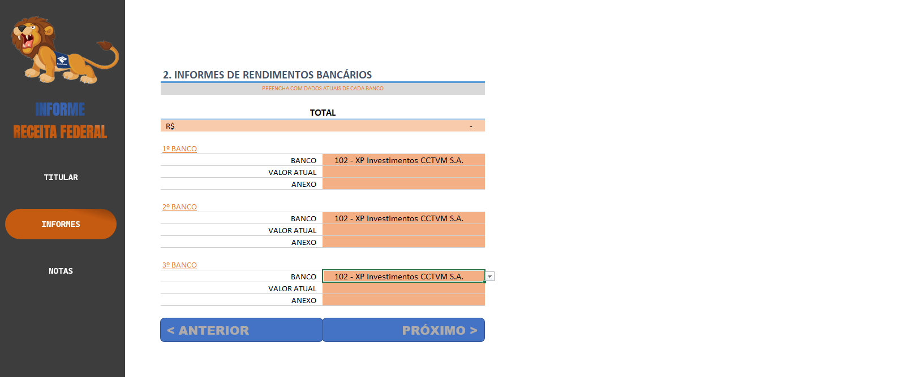
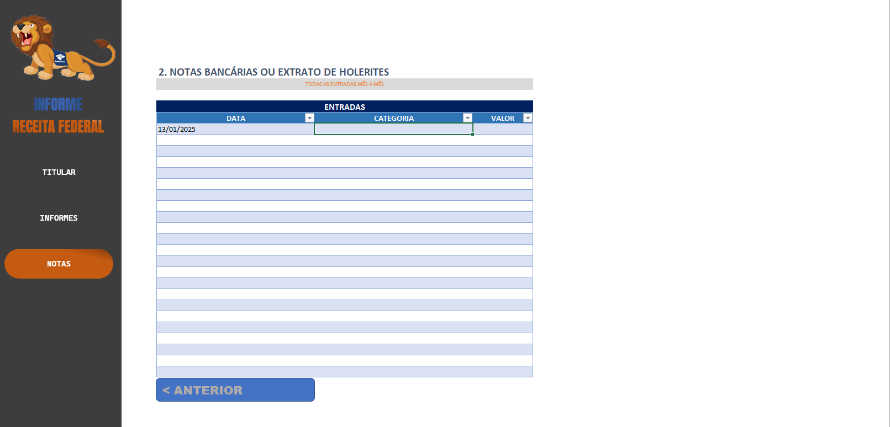

# Receita Federal Income Control (Excel)

Excel spreadsheet for **tracking and organizing income entries** for reporting to the Brazilian Receita Federal.

---

## Features
* Centralized income registry
* Dropdown menus and data validation
* Hyperlinks for fast navigation
* Macros (VBA) for task automation

---

## Technical Stack
* Excel
* Data Validation
* Hyperlinks
* VBA Macros

---

## Purpose

Provide a structured and automated solution for fiscal income control and tax reporting preparation.

